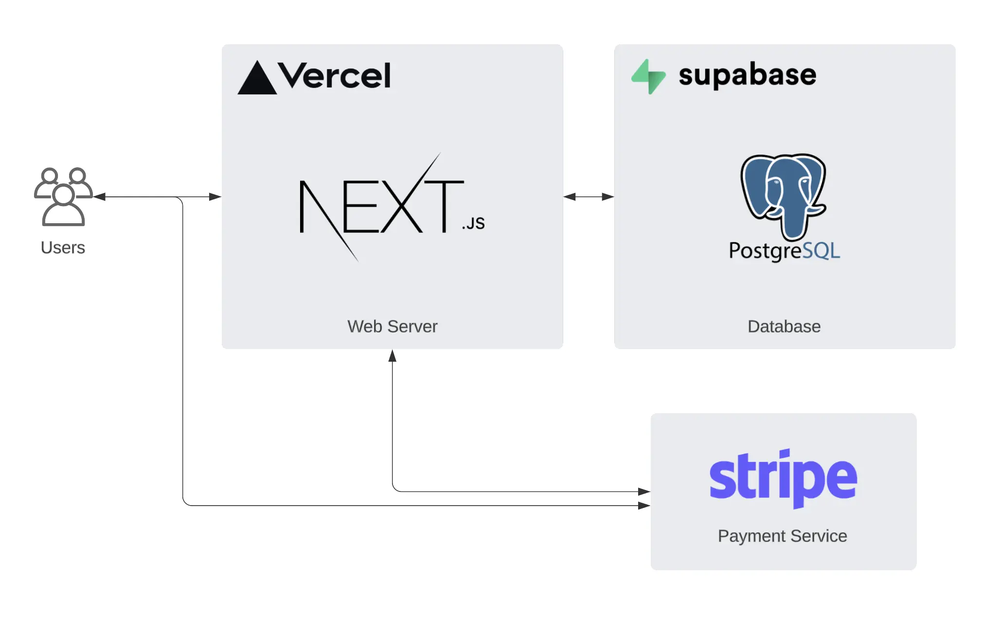
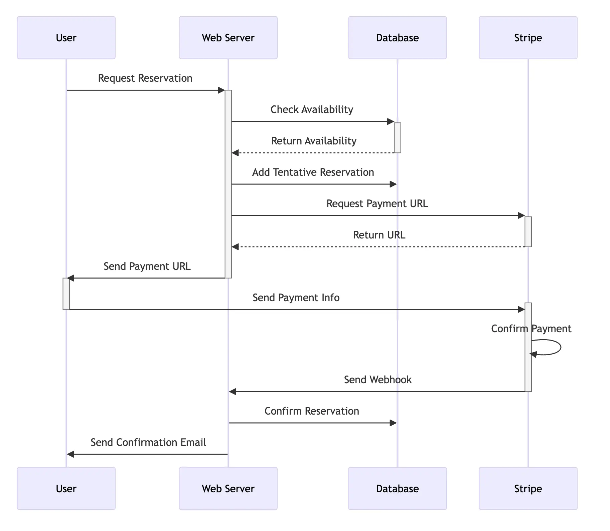

# Event Reservation System

This is a simple event reservation system built using [Next.js](https://nextjs.org/), using [Supabase](https://supabase.io/) as the database and [Stripe](https://stripe.com/) for payment processing.





## Prerequisites

Before you begin, make sure you have following set up on your machine:

- Node.js and npm (Node's package manager)
- Vercel CLI tool

You also need to create accounts on [Vercel](https://vercel.com/), [Supabase](https://supabase.io/), and [Stripe](https://stripe.com/) (if you use payment feature).

## Installation Steps

Follow these steps to deploy the Event Reservation System:

1. Clone the repository.

2. Navigate to the project directory:

```bash
$ cd event-reservation-system
```

3. Copy the contents of `env.example` file to a new `.env` file. Make sure to replace the dummy variables with your actual ones.

```bash
$ cp .env.example .env
```

4. Install the project's dependencies:

```bash
$ npm install
```

5. To start the application in development mode, execute:

```bash
$ npm run dev
```

You can access the application locally on the URL provided by Next.js, usually `http://localhost:3000`.

6. Now, to deploy your application, execute:

```bash
$ vercel
```

Now, the Event Reservation System should be up and running. You can access the system on the URL provided by Vercel.
